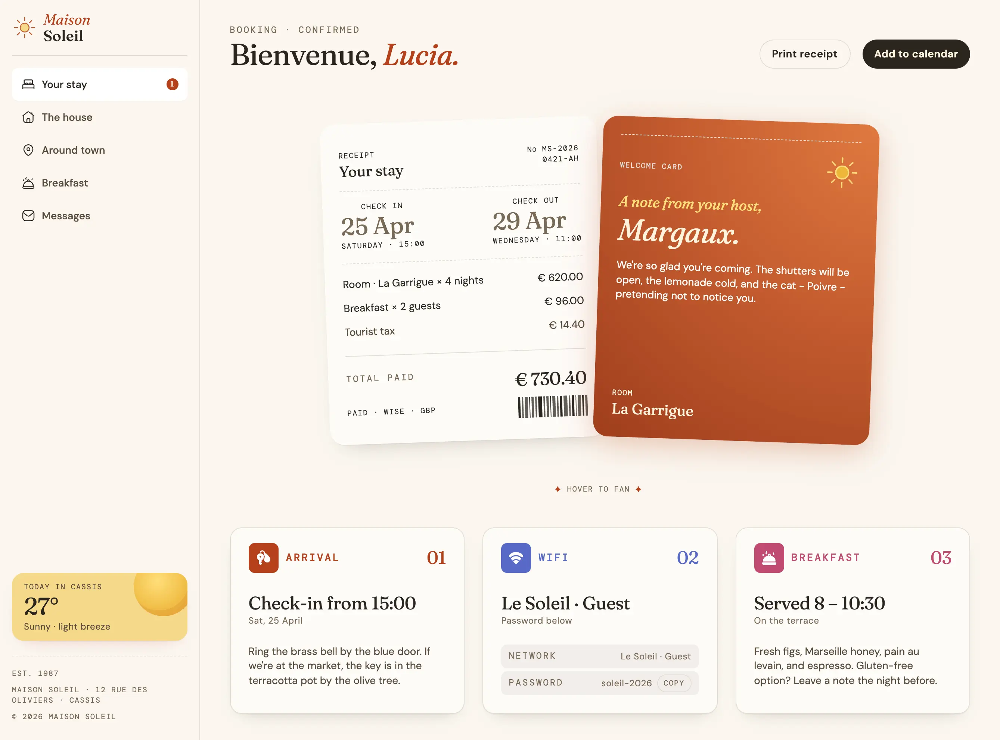

# Maison Soleil

Maison Soleil is a website that displays a booking confirmation page for a fictional hotel. It is one of the FrontendMentor.io challenges.

It is created using vanilla HTML, CSS and JavaScript; no frameworks or libraries.

To use it simply clone this repo and start a simple web server and serve the index.html file.

This page is responsive and tested in devices from iPhone SE, iPad, laptop and desktop size displays.

The page has a functional print receipt which prints only the receipt section using a `@media print` query. Additionally, it has a functional "Add to calendar" button, that adds the date, time and other information to Google Docs. Finally it also has a functional "copy" password button that adds the password to the system clipboard.
